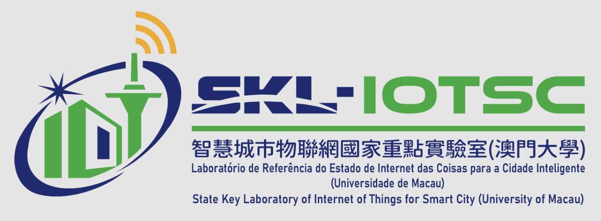








# About Me

Hi, there. I am He Sun (孙贺), a fourth-year Ph.D. student in the [Department of Computer Science and Technology](https://cs.ustc.edu.cn/main.htm) & [Suzhou Institute for Advanced Study](https://sz.ustc.edu.cn/index.html) & [State Key Laboratory of Cognitive Intelligence](http://cogskl.iflytek.com/) at the [University of Science and Technology of China](https://ustc.edu.cn/) (USTC), supervised by Prof. [Mingjun Xiao](http://staff.ustc.edu.cn/~xiaomj/indexEN.html). I was a master student at the School of Cyber Science and Technology, USTC. I am also lucky to have opportunities to collaborate with Prof. [Jie Wu](https://cis.temple.edu/~wu/) (Laura H. Carnell Professor, Temple University, Fellow of IEEE/AAAS), Prof. [Chengzhong Xu](https://www.fst.um.edu.mo/personal/czxu/) (Dean of [FST](https://www.fst.um.edu.mo/), Chair Professor, University of Macau, Fellow of IEEE), [Li Li](https://www.fst.um.edu.mo/personal/llili/) (Assistant Professor, University of Macau) and [Guoju Gao](http://web.suda.edu.cn/ggj/) (Associate Professor, Soochow University).

My research interests include Mobile Computing & ML Systems (e.g., Efficient LLM training/fine-tuning/inference/reasoning & RAG on resource-limited devices, Efficient Agentic System, Data Matching, and Connected Vehicles, etc.), Reinforcement Learning (Bandits/MARL, etc.), and Privacy Preservation (Differential Privacy). I have published several academic papers in top-tier international conferences and journals, including IEEE INFOCOM, IEEE ICDCS, IEEE ICDM, IEEE Transactions on Mobile Computing, IEEE Transactions on Parallel and Distributed Systems, etc. 

I will join HKU as a Postdoctoral Research Fellow in 2026. Please don't hesitate to contact me if you are interested in collaborating on my research.

**Stay hungry and stay foolish.**

# 🔥 News

- [2025.10] Serve as a Shadow PC of Eurosys 2026 Fall.
- [2025.2] Invited as an Eurosys 2025 [Artifact Evaluation Committee](https://2025.eurosys.org/artifact-eval-committee.html#pagetop)
- [2024.9] Join the State Key Laboratory of Internet of Things for Smart City as a Research Assistant.
- [2024.5] 🎉🎉 One paper was accepted in TMC 2024
- [2023.10] 🎉🎉 One paper was accepted in ICPADS 2023.
- [2023.10] 🎉🎉 The paper accepted in MASS 2023 was awarded Best Paper!!! [[link]](https://cis.temple.edu/ieeemass2023/)
- [2023.3] 🎉🎉 I won the Suzhou Industrial Park Scholarship!
- [2022.12] 🎉🎉 I won the "Yang Yuanqing" Scholarship!
- [2022.12] 🎉🎉 Two of my authored papers were accepted by IEEE INFOCOM 2023!

# 📝 Publications 

## Preprint
- **He Sun**, Li Li, Mingjun Xiao, Chengzhong Xu, "Breaking the Boundaries of Long-Context LLM Inference: Adaptive KV Management on a Single Commodity GPU", Arxiv' 25 [[Paper]](https://arxiv.org/pdf/2506.20187) (Related version is accepted by the Shadow PC of Eurosys 2026 Spring)
- **He Sun**, Junyuan Mao, Mingjun Xiao, "DataCupid: High-Quality Data Acquisition via Adaptive Task-Expert Stable Matching for LLM Reasoning", Arxiv' 25 
- Yebo Wu, Chunlin Tian, Jingguang Li, **He Sun**, Kahou Tam, Li Li, Chengzhong Xu. "A Survey on Federated Fine-tuning of Large Language Models", Arxiv' 25 [[paper]](https://arxiv.org/pdf/2503.12016) [[project]](https://github.com/Clin0212/Awesome-Federated-LLM-Learning) 
- Zijie Lin, Yiqing Shen, Qilin Cai, **He Sun**, Jinrui Zhou, Mingjun Xiao. "AutoP2C: An LLM-Based Agent Framework for Code Repository Generation from Multimodal Content in Academic Papers", Arxiv' 25[[Paper]](https://arxiv.org/pdf/2504.20115?) 
- Haotian Xu, Jinrui Zhou, Xichong Zhang, Mingjun Xiao, **He Sun**, Yin Xu. "SFedKD: Sequential Federated Learning with Discrepancy-Aware Multi-Teacher Knowledge Distillation", Arxiv' 25[[Paper]](https://arxiv.org/pdf/2507.08508)
  
## Conferences and Journals
- <a style="color: #0000FF;"><b>[VLDB'26]</b></a> **He Sun**, Junyuan Mao, Mingjun Xiao. "DataCupid: High-Quality Data Acquisition via Adaptive Task-Expert Stable Matching for LLM Reasoning", 52nd International Conference on Very Large Data Bases, 2026 (Under Review)
- <a style="color: #ff0000;"><b>[ICDM'25]</b></a> Yukai Zhu, **He Sun**, Mingjun Xiao. "Federated Graph Out-of-Distribution Generalization via Representation Propagation and Scattering", IEEE International Conference on Data Mining 2025, (Acceptance Rate: 106/785=13.5%)
- <a style="color: #ff0000;"><b>[TMC'24]</b></a> **He Sun**, Mingjun Xiao, Yin Xu, Guoju Gao, Shu Zhang. "Crowdsensing Data Trading for Unknown Market: Privacy, Stability, and Conflicts", IEEE Transactions on Mobile Computing, 2024. [[paper]](https://ieeexplore.ieee.org/document/10529594) 
- <a style="color: #ff0000;"><b>[INFOCOM'23]</b></a> **He Sun**, Mingjun Xiao, Yin Xu, Guoju Gao, Shu Zhang "Privacy-preserving Stable Crowdsensing Data Trading for Unknown Market", Proc. IEEE INFOCOM'23, May. 2023, (Acceptance Rate: 252/1312=19.2%). [[Paper]](https://ieeexplore.ieee.org/abstract/document/10228966) [[Slide]](http://home.ustc.edu.cn/~hesun/INFOCOM23-slide.pdf)
- <a style="color: #ff0000;"><b>[TPDS'24]</b></a> Yin Xu, Mingjun Xiao, Jie Wu, **He Sun**. "Privacy-Preserving Task Push in Spatial Crowdsourcing with Unknown Popularity", IEEE Transactions on Parallel and Distributed Systems, 2024
- <a style="color: #ff0000;"><b>[JCST'24]</b></a> Yin Xu, Mingjun Xiao, Jie Wu, Chen Wu, Jinrui Zhou, and **He Sun**. "Age-of-Information-Aware Federated Learning", Journal of Computer Science and Technology, 2024
- <a style="color: #ff0000;"><b>[ICDCS'24]</b></a> Yu Zhao, Jinrui Zhou, Mingjun Xiao, Jie Wu, and **He Sun**, "ERS: Faster LiDAR Point Cloud Registration for Connected Vehicles", ICDCS'24
- <a style="color: #ff0000;"><b>[MASS'24]</b></a> Xinwei Huang, Yin Xu, **He Sun**, Jinbo Cai, Yifan Duan, Mingjun Xiao, Jie Wu. "Q2oE-Aware Deep Reinforcement Learning for Mobile Vehicles in Collaborative Edge Servers", Proc. IEEE MASS 2024
- <a style="color: #0000FF;"><b>[TSC]</b></a> Junjie Shao, Yu Zhao, **He Sun**, Jinbo Cai, Jie Wu, Mingjun Xiao. "Cooperative Traffic Signal Online Control Using Game Theory and Contextual Bandit", IEEE Transactions on Services Computing, 2024 (Under Review)
- <a style="color: #ff0000;"><b>[INFOCOM'23]</b></a>  Shu Zhang, Mingjun Xiao, Guoju Gao, Yin Xu, **He Sun** "Offloading Tasks to Unknown Edge Servers: A Contextual Multi-Armed Bandit Approach", Proc. IEEE INFOCOM WKSHPS: ICCN 2023. [[Paper]](https://ieeexplore.ieee.org/document/10226047)
- <a style="color: #ff0000;"><b>[MASS'23]</b></a>  Chen Wu, Mingjun Xiao, Jie Wu, Jinrui Zhou, Yin Xu and **He Sun**, "Towards Federated Learning on Fresh Datasets", Proc. IEEE MASS 2023. (**Best Paper Award**) [[paper]](https://cis.temple.edu/~wu/research/publications/Publication_files/MASS2023_Bestpaper.pdf) [[Slide]](https://cis.temple.edu/~wu/research/publications/Publication_files/Slide_MASS2023_Final.pdf)
- <a style="color: #ff0000;"><b>[ICPADS'23]</b></a> Jinbo Cai, Mingjun Xiao, **He Sun**, Junjie Shao, Yu Zhao, Tongxiao Zhang. "Video Streaming Caching and Transcoding for Heterogeneous Mobile Users", Proc. ICPADS'23. [[Paper]](https://ieeexplore.ieee.org/abstract/document/10476058)
- <a style="color: #0000FF;"><b>[TMC]</b></a> Yu Zhao, **He Sun**, Mingjun Xiao, Jie Wu, Junjie Shao, Jinbo Cai. "Edge-assisted Multi-vehicle Cooperative Perception: an Approach Based on Relative Pose Estimation", IEEE Transactions on Mobile Computing, 2023 (Under Review)


<!-- 更多内容 -->

    <ul>
        <li> <b>He Sun</b>, Jinrui Zhou, Li Li, Mingjun Xiao. "CoEdgeLLM: Cloud-Edge-Device Collaborative Federated Fine-tuning with Zeroth-Order Optimization for Large Language Models", (Under Review)
       </li>
        <li> <b>He Sun</b>, Haotian Xu, Mingjun Xiao. "MeFill: Memory Efficient Federated Fine-tuning for Long-Context Large Language Models", (Under Review)
        </li>
        <li> <b>He Sun</b>, Li Li, Mingjun Xiao, Chengzhong Xu. "Efficient RAG System on a Commodity GPU with Computational Storage.", (Under Review)
        </li>
    </ul>

<!--More按钮-->

More...



## Book Chapter
- Mingjun Xiao, Yin Xu, **He Sun**. ["Unknown Worker Recruitment in Mobile Crowdsourcing"](https://link.springer.com/chapter/10.1007/978-3-031-32397-3_3) in ["Mobile Crowdsourcing: From Theory to Practice"](https://link.springer.com/book/10.1007/978-3-031-32397-3), edited by Jie Wu and En Wang, 2023, (Part of the Wireless Networks book series)

# 📝 Experiences 

2024.09 - Now a Research Assistant supervised by [Li Li](https://www.fst.um.edu.mo/personal/llili/) and mentored by [Chengzhong Xu](https://www.fst.um.edu.mo/personal/czxu/).

State Key Laboratory in the Internet of Things for Smart City, University of Macau, Macau, China.

2022.07 - Now, a Research Assistant (Ph.D. student) supervised by [Mingjun Xiao](http://staff.ustc.edu.cn/~xiaomj/indexEN.html).

School of Computer Science and Technology, mentored by [Xiangyang Li](https://cs.ustc.edu.cn/2020/0806/c23235a460096/page.htm)/State Key Laboratory of Cognitive Intelligence, mentored by [Enhong Chen](http://staff.ustc.edu.cn/~cheneh/), University of Science and Technology of China, Hefei, China.

# 📖 Professional Services

## Conferences
- Shadow TPC Member of Eurosys 2026
- Eurosys 2025 [Artifact Evaluation Committee](https://2025.eurosys.org/artifact-eval-committee.html#pagetop)
- IEEE INFOCOM 2022 External reviewer
- IEEE INFOCOM 2023 External reviewer

## Journals
* Reviewer:
  - IEEE Transactions on Mobile Computing (TMC)
  - IEEE Transactions on Network and Service  Management (TNSM)
  - IEEE Transactions on Parallel and Distributed Systems (TPDS)
* External reviewer:
  - IEEE Transactions on Networking (ToN)
  - IEEE Transactions on Service Computing (TSC)
  - IEEE Transactions on Big Data (TBD)
  - Information Science (InfoSci)
 
# 🎖 Honors and Awards

## Honors
- Suzhou Industrial Park Scholarship at USTC (2023.3)
- "Yang Yuanqing" Scholarship at USTC (Selecting 4 PhD students in the 2022 class of the School of Computer Science, 2022.12)
- Excellent League member at USTC (2021.4)
- 5 times first-class scholarship at QDU (2016-2020)
- "Shuguang" scholarship (2019.10)
- Outstanding student leaders prize at QDU (2018.10)
- Outstanding graduate prize at QDU (2020.5)

## Competitions Awards
- Second Prize in China Software Open Source Innovation Competition (National College Green Computing) Contest-21 (Open source project innovation competition) by CCF, 2021.
- Outstanding Winner(Top-1) in National College Green Computing Contest-19 (Project Challenge) by CCF, 2019.
- Outstanding Winner(Top-3) in National College Green Computing Contest-18 (Project Challenge) by CCF, 2018.
- Third Prize in Math Competition for College Students, 2019. 
- Third Prize(Top-8) in Imagine Cup 2018 of Microsoft, 2018. 
- First prize in the National High School Mathematics Competition in Shandong Province, 2015.

# 💬 Talks

- *2023.05*: &nbsp; IEEE INFOCOM 2023, 17-20 May, Stevens Institute of Technology, New York Area. [slides](https://ustc-sunny.github.io/INFOCOM2023_slides.pdf)
- *2024.07*: &nbsp; CIBD 2024, 20 July, State Key Laboratory of Cognitive Intelligence, USTC&iFlytek, Hefei. [Poster](https://ustc-sunny.github.io/CIBD2024_sunhe.pdf)

# 💻 Project

- National Innovation and Entrepreneurship Program for College Students in China, The Research and Development of Parking Sharing System in Smart City, 2018.5-2020.5.: **Project leader**
- Project of National Natural Science Foundation of China, Research on Intelligent and Trusted Cooperation Mechanism of Mobile Group Intelligence Computing based on blockchain, 2022.01-2025.12: **Core member**
- Project of National Natural Science Foundation of China, Research on Key Technologies of Secure and Trusted Mobile Group Intelligence Sensing Data Trading System, 2019.01-2022.12：**Core member**
- Jiangsu Provincial Natural Science Foundation Project, Research on Key Technologies of Data Trading System based on Mobile Group Intelligence Perception, 2019.07-2022.0：**Core member**

# Misc.

<!-- HTML 部分：放在你想显示照片的地方 -->
  <h2 style="border-bottom: 1px solid #eaecef; padding-bottom: .3em;">Misc.</h2>
  

  <!-- 照片矩阵容器 -->
  

    <!-- 照片 1 -->
    

      
      
📍 东京, 日本

    

    
    <!-- 照片 2 -->
    

      
      
📍 巴黎, 法国

    

    <!-- 照片 3 -->
    

      
      
📍 纽约, 美国

    

    
    <!-- 您可以在这里添加更多 .photo-item -->
    

      
      
📍 伦敦, 英国

    

  

<!-- 灯箱模态框结构（放在页面底部即可） -->

  &times;
  
  

<!-- CSS 样式 -->

<!-- JS 脚本 -->

