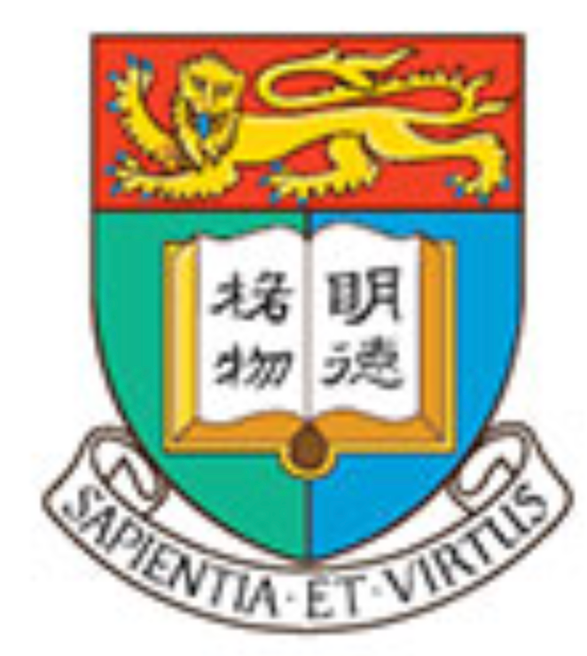
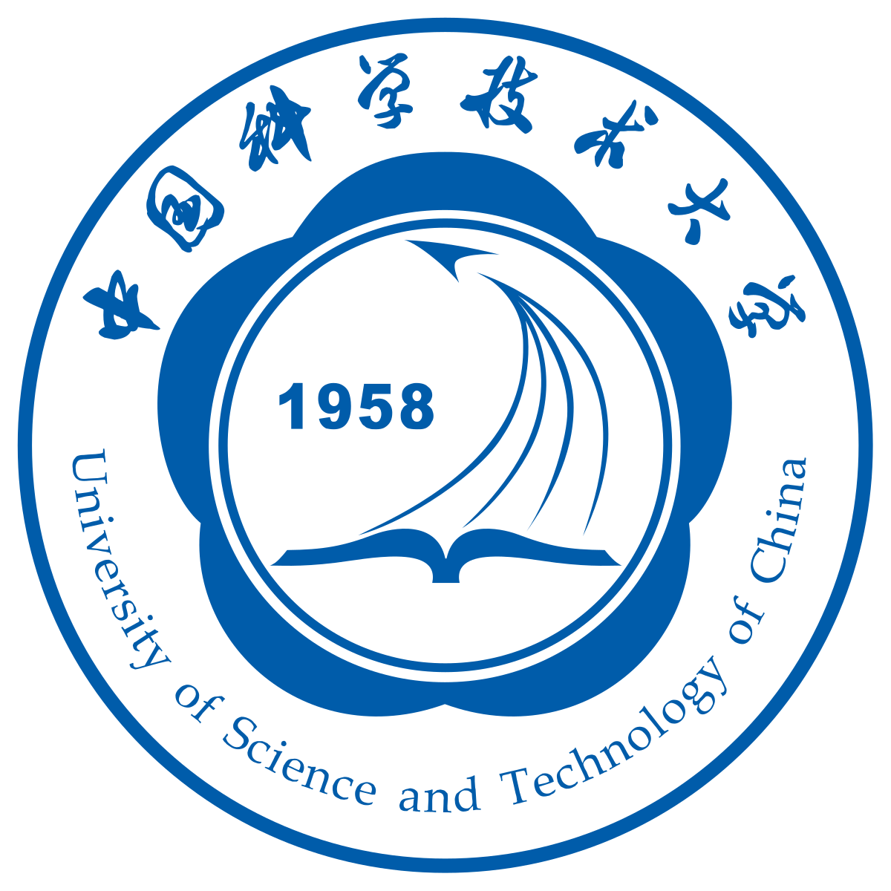
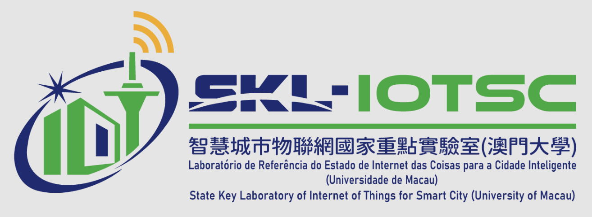
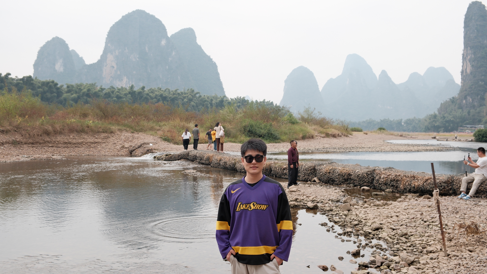
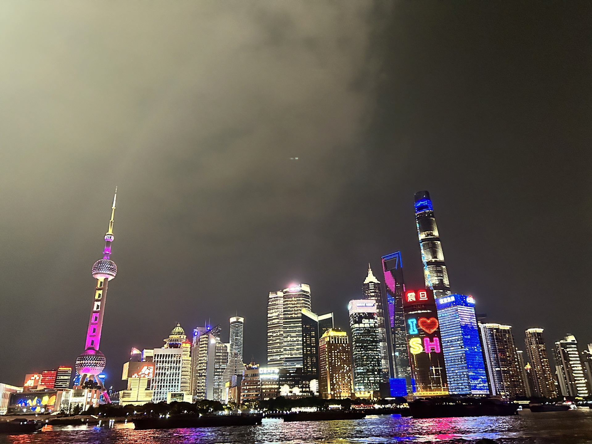
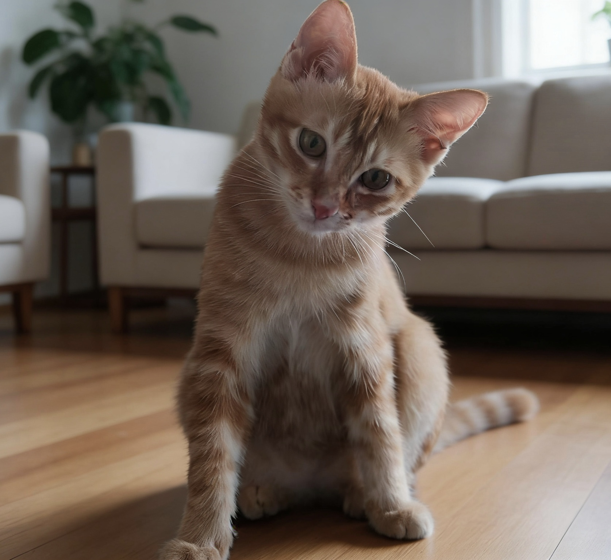
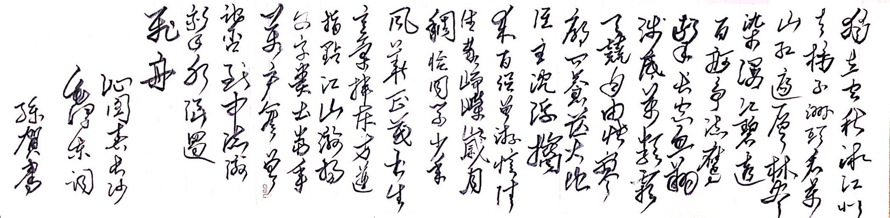
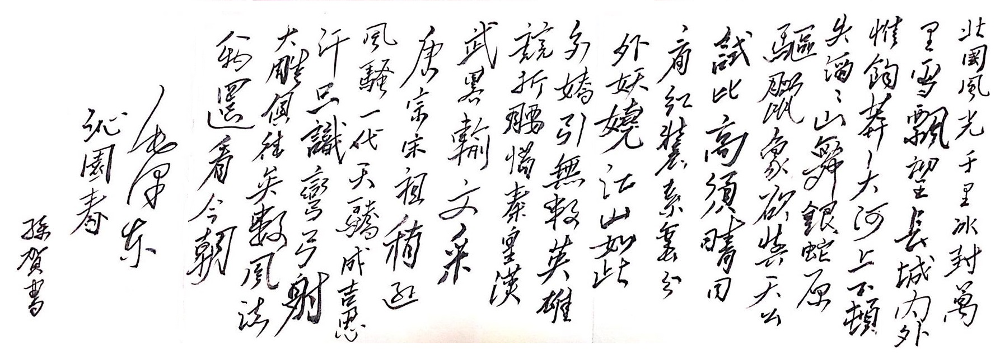








# About Me

Hi there, I am He Sun (孙贺). I am currently a Postdoc Fellow at [The University of Hong Kong](https://hku.hk), working with Prof. [Shinan Liu](https://www.shinan.info). I earned my Ph.D. from the [Department of Computer Science and Technology](https://cs.ustc.edu.cn/main.htm) & [Suzhou Institute for Advanced Study](https://sz.ustc.edu.cn/index.html) & [State Key Laboratory of Cognitive Intelligence](http://cogskl.iflytek.com/) at the [University of Science and Technology of China](https://ustc.edu.cn/) (USTC), supervised by Prof. [Mingjun Xiao](http://staff.ustc.edu.cn/~xiaomj/indexEN.html). I was a master student at the School of Cyber Science and Technology, USTC.

I am also lucky to have opportunities to collaborate with Prof. [Jie Wu](https://cis.temple.edu/~wu/) (Laura H. Carnell Professor, Temple University, Fellow of IEEE/AAAS), Prof. [Chengzhong Xu](https://www.fst.um.edu.mo/personal/czxu/) (Dean of [FST](https://www.fst.um.edu.mo/), Chair Professor, University of Macau, Fellow of IEEE), Prof. [Zili Meng](https://zilimeng.com/) (Assistant Professor, HKUST), Prof. [Li Li](https://www.fst.um.edu.mo/personal/llili/) (Assistant Professor, University of Macau), [Wenhao Jiang](https://cswhjiang.github.io/) (Lead Researcher, Guangming Lab) and Prof. [Guoju Gao](http://web.suda.edu.cn/ggj/) (Associate Professor, Soochow University).

My research interests include Mobile Computing & ML Systems (e.g., Efficient LLM training/fine-tuning/inference/reasoning & RAG on resource-limited devices, Efficient Agentic System, Data Matching, and Connected Vehicles, etc.), Reinforcement Learning (Bandits/MARL, etc.), and Privacy Preservation (Differential Privacy). I have published several academic papers in top-tier international conferences and journals, including IEEE INFOCOM, ACM SIGKDD, ACM Eurosys Shadow, ICML, TMC, TPDS, ICDCS, ICDM, TMLR, JCST, ICASSP, MASS, ICPADS, etc. I am also contributing to [WiCi AI](https://wici.ai), an early-stage startup building the local computing layer for the AI era.

Please don't hesitate to contact me if you are interested in collaborating on my research. **Stay hungry and stay foolish.**

# 🔥 News

- [2026.6] 🎉🎉 I earned my Ph.D. from USTC and will be joining HKU as a Postdoctoral Fellow in the fall of 2026.
- [2026.5] 🎉🎉 I successfully defended my doctoral dissertation at the USTC.
- [2026.5] 🎉🎉 Two papers were accepted in SIGKDD 2026 and ICML 2026.
- [2026.4] Serve as an STPC Member of IMC 2026.
- [2026.2] 🎉🎉 One paper was accepted in TMC 2026.
- [2026.1] 🎉🎉 Two papers were accepted in ICASSP, TMLR 2026.
- [2025.10] Serve as a [Shadow TPC Member](https://2026.eurosys.org/shadow-program-committee.html#pc) of Eurosys 2026 Fall.
- [2025.2] Invited as an Eurosys 2025 [Artifact Evaluation Committee](https://2025.eurosys.org/artifact-eval-committee.html#pagetop)
- [2024.5] 🎉🎉 One paper was accepted in TMC 2024
- [2023.10] 🎉🎉 The paper accepted in MASS 2023 was awarded Best Paper!!! [[link]](https://cis.temple.edu/ieeemass2023/)
- [2023.3] 🎉🎉 I won the Suzhou Industrial Park Scholarship!
- [2022.12] 🎉🎉 I won the "Yang Yuanqing" Scholarship!
- [2022.12] 🎉🎉 Two of my authored papers were accepted by IEEE INFOCOM 2023!

# 📝 Publications
{: #publications-heading }

## Preprints
- **He Sun**, Shinan Liu, Siyuan Ma, Junhao Li, Mingjun Xiao, Wenhao Jiang. "Agent-Assisted Side-Channel Attacks on Non-Prefix KV Cache in RAG ". Arxiv' 26 [[Paper]](https://arxiv.org/abs/2606.21842)[[Twitter Post]](https://x.com/gastronomy/status/2069246521531396456)[[Paper Review]](https://www.dailysecurity.cn/topics/LLM-security-2/) 
- **He Sun**, Shinan Liu, Li Li, Mingjun Xiao. "HillInfer: Efficient Long-Context LLM Inference on the Edge with Hierarchical KV Eviction using SmartSSD". Arxiv' 26 [[Paper]](https://arxiv.org/abs/2602.18750) [[Twitter Post]](https://x.com/WWVY/status/2026232659219804577) 
- **He Sun**, Li Li, Mingjun Xiao, Chengzhong Xu. "Breaking the Boundaries of Long-Context LLM Inference: Adaptive KV Management on a Single Commodity GPU", Arxiv' 25 [[Paper]](https://arxiv.org/abs/2506.20187) [[Twitter Post]](https://x.com/rohanpaul_ai/status/1940335638714441872) (Related version is accepted by the Shadow PC of Eurosys 2026 Spring)
- **He Sun**, Junyuan Mao, Wenhao Jiang, Mingjun Xiao, Shinan Liu. "DataCupid: High-Quality Data Acquisition via Adaptive Stable Matching with Dalayed Feedback.", Arxiv' 26 [[Paper]](./#)
- Haotian Xu, Jinrui Zhou, Xichong Zhang, Mingjun Xiao, **He Sun**, Yin Xu. "SFedKD: Sequential Federated Learning with Discrepancy-Aware Multi-Teacher Knowledge Distillation", Arxiv' 25[[Paper]](https://arxiv.org/pdf/2507.08508)
  
## Selected Papers



## Book Chapter
- Mingjun Xiao, Yin Xu, **He Sun**. ["Unknown Worker Recruitment in Mobile Crowdsourcing"](https://link.springer.com/chapter/10.1007/978-3-031-32397-3_3) in ["Mobile Crowdsourcing: From Theory to Practice"](https://link.springer.com/book/10.1007/978-3-031-32397-3), edited by Jie Wu and En Wang, 2023, (Part of the Wireless Networks book series)

<button type="button" id="publications-toggle" class="publications-toggle" aria-expanded="true" aria-controls="publication-list book-chapters" hidden>See all publications</button>

# 📝 Experiences 

2026 - now, a Postdoc Fellow working with Prof. [Shinan Liu](https://www.shinan.info/) in [NAISS lab](https://naisslab.github.io/).
Department of Data and Systems Engineering, mentored by [Professor Ning Xi](https://www.dase.hku.hk/people/n-xi), The University of Hong Kong, Hong Kong SAR, China.

2022 - 2026, a Ph.D. Research Assistant supervised by Prof. [Mingjun Xiao](http://staff.ustc.edu.cn/~xiaomj/indexEN.html).
School of Computer Science and Technology, mentored by Prof. [Xiangyang Li](https://cs.ustc.edu.cn/2020/0806/c23235a460096/page.htm)/State Key Laboratory of Cognitive Intelligence, mentored by Prof. [Enhong Chen](http://staff.ustc.edu.cn/~cheneh/), University of Science and Technology of China, Hefei, China. 
Dissertation: A Data Flow Synergistic Optimization System for the Fine-Tuning and Deployment of Personalized LLMs.

2024 - 2026, a Research Assistant working with Prof. [Li Li](https://www.fst.um.edu.mo/personal/llili/) and mentored by Prof. [Chengzhong Xu](https://www.fst.um.edu.mo/personal/czxu/) and [Yonghua song](https://rto.um.edu.mo/biography/).

State Key Laboratory in the Internet of Things for Smart City, University of Macau, Macau SAR, China.

2020 - 2022, a Master's Research Assistant supervised by Prof. [Mingjun Xiao](http://staff.ustc.edu.cn/~xiaomj/indexEN.html).
School of Cyber Science and Technology, mentored by Prof. [Nenghao Yu]([https://cs.ustc.edu.cn/2020/0806/c23235a460096/page.htm](https://scholar.google.com/citations?user=7620QAMAAAAJ&hl=zh-CN))/State Key Laboratory of Cognitive Intelligence, mentored by [Enhong Chen](http://staff.ustc.edu.cn/~cheneh/), University of Science and Technology of China, Hefei, China. 

# 📖 Professional Services

## Conferences
- STPC Member of IMC 2026
- [Shadow TPC Member](https://2026.eurosys.org/shadow-program-committee.html#pc) of Eurosys 2026
- Eurosys 2025 [Artifact Evaluation Committee](https://2025.eurosys.org/artifact-eval-committee.html#pagetop)
- IEEE INFOCOM 2022 External reviewer
- IEEE INFOCOM 2023 External reviewer

## Journals
* Reviewer:
  - IEEE Transactions on Mobile Computing (TMC)
  - IEEE Transactions on Network and Service  Management (TNSM)
  - IEEE Transactions on Parallel and Distributed Systems (TPDS)
  - Pattern Recognition (PR)
* External reviewer:
  - IEEE Transactions on Networking (ToN)
  - IEEE Transactions on Service Computing (TSC)
  - IEEE Transactions on Big Data (TBD)
  - Information Science (InfoSci)
 
# 🎖 Honors and Awards

## Honors
- Best Paper Award of IEEE MASS 2023 (2023.9)
- Suzhou Industrial Park Scholarship at USTC (2023.3)
- "Yang Yuanqing" Scholarship at USTC (Selecting 4 PhD students in the 2022 class of the School of Computer Science, 2022.12)
- 5 times first-class scholarship (2016-2020)
- "Shuguang" scholarship (2019.10)
- Outstanding graduate prize (2020.5)

## Competitions Awards
- Second Prize in China Software Open Source Innovation Competition (National College Green Computing) Contest-21 (Open source project innovation competition) by CCF, 2021.
- Outstanding Winner(Top-1) in National College Green Computing Contest-19 (Project Challenge) by CCF, 2019.
- Outstanding Winner(Top-3) in National College Green Computing Contest-18 (Project Challenge) by CCF, 2018.
- Third Prize in Math Competition for College Students, 2019. 
- Third Prize(Top-8) in Imagine Cup 2018 of Microsoft, 2018. 
- First prize in the National High School Mathematics Competition in Shandong Province, 2015.

# 💬 Talks

- *2023.05*: &nbsp; IEEE INFOCOM 2023, 17-20 May, Stevens Institute of Technology, New York Area. [slides](https://ustc-sunny.github.io/INFOCOM2023_slides.pdf)
- *2024.07*: &nbsp; CIBD 2024, 20 July, State Key Laboratory of Cognitive Intelligence, USTC&iFlytek, Hefei. [Poster](https://ustc-sunny.github.io/CIBD2024_sunhe.pdf)

# 💻 Grants

- National Innovation and Entrepreneurship Program for College Students in China, The Research and Development of Parking Sharing System in Smart City, 2018.5-2020.5.: **Project leader**
- Project of National Natural Science Foundation of China, Research on Intelligent and Trusted Cooperation Mechanism of Mobile Group Intelligence Computing based on blockchain, 2022.01-2025.12: **Core member**
- Project of National Natural Science Foundation of China, Research on Key Technologies of Secure and Trusted Mobile Group Intelligence Sensing Data Trading System, 2019.01-2022.12：**Core member**
- Jiangsu Provincial Natural Science Foundation Project, Research on Key Technologies of Data Trading System based on Mobile Group Intelligence Perception, 2019.07-2022.0：**Core member**

# Misc.
  

- **Hobbies**: Sports: Football, Basketball, Ping Pong, etc.; Music: Folk Music, Rock Music, etc.; Calligraphy: Xizhi Wang, Runzhi Mao; Singing
- **Favorite**: Football team: Manchester City; NBA team: L.A. Lakers; Singers: Jay Chou, Lei Zhao, Eson, JJ, GEM, Leehom
- **Some Photos**: Traveling, Conference talk, and pet, etc.（Click to view the large image）
  <!-- 照片矩阵容器 -->
  

    <!-- 照片 1 -->
    

      
      
Landscape of Guilin 📍 Guilin, Guangxi

    

    <!-- 照片 2 -->
    

      
      
Statue of Liberty 📍 Manhattan, New York

    

    <!-- 照片 3 -->
    

      
      
INFOCOM 2023 📍 Stevens Institute of Technology, New Jersey

    

    

      
      
Xueliang
        Zhang's Former Residence with my love 📍 Shenyang, China

    

    

      
      
Huangpu River 📍 Shanghai, China

    

    

      
      
My Cat PiPi 📍 Macau/Zhuhai, China

    

    

      
      
沁园春·长沙, Mao's calligraphy 📍 Jinan, China

    

    <!-- 您可以在这里添加更多 .photo-item -->
    

      
      
沁园春·雪, Mao's calligraphy 📍 Jinan, China

    

  

  <!-- 分隔线 (可选，增加视觉分离感) -->
  

  
<!-- 灯箱模态框结构 -->

  &times;
  
  

<!-- CSS 样式 -->

<!-- JS 脚本 -->

